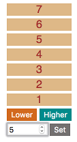

# Adding Actions

A new requirement has arisen. As well as being able to raise or lower a column by one, the client wants to be able to set a column to a specific height by entering the height in a text input, like this:

1. What should a "set height" _action_ look like?
1. Will your state object need to change to accommodate this new requirement?
1. Add the `<input>` and `<button>` elements to the `Column` component and check that they appear in the UI.
1. Add an action type, e.g. `SET_HEIGHT`.
1. Add an action creator for this action.
1. Dispatch an action of this type when the `Set` button is clicked.
   Remember to include a `height` or `value` in the action to represent the
   desired height.
